<a href="#selected-work">SELECTED WORK</a> &nbsp; / &nbsp; <a href="#public-code-and-contributions">PUBLIC CODE</a> &nbsp; / &nbsp; <a href="#skills-and-tools">SKILLS</a> &nbsp; / &nbsp; <a href="https://www.upwork.com/freelancers/~01a9384f82d1a7dbec">WORK WITH ME ↗</a>

   

<table><tr><td width="33%">CURRENTLY <strong>Incubyte → Rolai</strong></td><td width="33%">FOCUS <strong>Full-stack &amp; applied AI</strong></td><td width="34%">EXPERIENCE <strong>6+ years building software</strong></td></tr></table>

I build interactive web applications, backend product features and tools around **generative AI and LLM integration**. I have **6+ years of professional experience** across education, workflow software and ecommerce, with a strong foundation in **React, TypeScript and Node.js**.

My work often connects product interfaces with APIs, application state and recovery when something goes wrong.

## Selected work

<table>
<tr>
<td width="50%" valign="top">

01 / ROLAI / INCUBYTE

<h3>AI workflow software</h3>

<code>Workflow orchestration</code> · <code>State management</code> · <code>Developer tools</code>

Rolai is a product for connecting workflow steps and working with application data. At Incubyte, I contribute to its execution systems, data operations and user-facing features.

<ul><li><strong>Workflow reliability:</strong> improved execution-state and memory handling, and investigated failure and recovery paths.</li><li><strong>Data operations:</strong> added bulk creation, updates and deletion of datastore records.</li><li><strong>Developer tools:</strong> designed and used an AI-assisted code-review workflow that checks new changes against relevant concerns from past reviews.</li></ul>
</td>
<td width="50%" valign="top">

02 / MATHAI / THE HOMEWORK APP

<h3>Interactive math learning</h3>

<code>EdTech</code> · <code>Interactive applications</code> · <code>Payment integration</code>

MathAI turns authored lessons into interactive math exercises. At The Homework App, I contributed across its content editor, learner activities and subscription services.

<ul><li><strong>Lesson authoring:</strong> built controls for configurable tables, LaTeX cells, cell merging, shapes and answer evaluation.</li><li><strong>Learner interactions:</strong> extended tap/select and drag-and-drop activities with partial-answer feedback, rounds and timers.</li><li><strong>Subscription lifecycle:</strong> implemented regional coupons, tax/currency rules, recurring payments and profile-state handling.</li></ul>
</td>
</tr>
<tr>
<td width="50%" valign="top">

03 / INTERNAL AI GAME BUILDER

<h3>Educational content authoring</h3>

<code>Agentic workflows</code> · <code>Claude Code</code> · <code>Multi-agent orchestration</code>

At The Homework App, I built a <strong>Claude Code multi-agent workflow</strong> that turns educational ideas into playable HTML games. I developed shared components for consistent layouts, progress and transitions, coordinated audio with interaction state, and added application instrumentation for session metrics and answer-attempt history. The builder was internal; its resulting games were published to learners.

</td>
<td width="50%" valign="top">

04 / UPLARA / ECOMMERCE

<h3>Ecommerce tools</h3>

<code>Generative AI</code> · <code>Ecommerce</code> · <code>WebGL</code>

At Uplara, I developed a GPT-based tool to help merchants improve product-listing content, alongside separate commerce-extension and WebGL product-viewer work.

</td>
</tr>
</table>

Earlier work includes learning and event-booking applications, HR tools, and leading frontend development for the LensHood React marketplace.

## Public code and contributions

<table>
<tr><td width="50%" valign="top"><h3><a href="https://github.com/elastic/eui/pull/3174">Elastic UI — merged PR #3174</a></h3>
Mobile navigation scrolling fix, snapshot updates and maintainer review.
</td><td width="50%" valign="top"><h3><a href="https://github.com/lokeshrana9999/books-api">Books API</a></h3>
TypeScript/Fastify/Prisma API project with authentication, audit logging and tests.
</td></tr>
<tr><td width="50%" valign="top"><h3><a href="https://github.com/lokeshrana9999/incubyte-salary-management">Salary management</a></h3>
Python/FastAPI/SQLAlchemy exercise documenting AI assistance and human checkpoints.
</td><td width="50%" valign="top"><h3><a href="https://www.shraddhapailab.com/our-team">Google Summer of Code — Shraddha Pai Lab</a></h3>
Gene-annotation visualization contribution.
</td></tr>
</table>

## Skills and tools

| Area | Technologies and practices |
| --- | --- |
| **Frontend development** | React, TypeScript, JavaScript, component-based UI development, reusable components, state management |
| **Backend & APIs** | Node.js, Express.js, PostgreSQL, SQL, GraphQL, REST APIs, API integration |
| **AI & developer tools** | Generative AI, LLM integration, AI agent development, multi-agent workflows, Claude Code, workflow orchestration |
| **Engineering practices** | Debugging, code review, automated testing, workflow reliability and recovery |
| **Interactive applications** | PixiJS, WebGL, data visualization, educational technology |
| **Additional project work** | Python, FastAPI, SQLAlchemy, Fastify, Prisma |

I care about understandable code, reusable components and useful failure handling. Outside professional work, I explore creative tools, visualization and desktop utilities.

---

**Education:** IIT Guwahati — BTech, Bioscience and Bioengineering.
